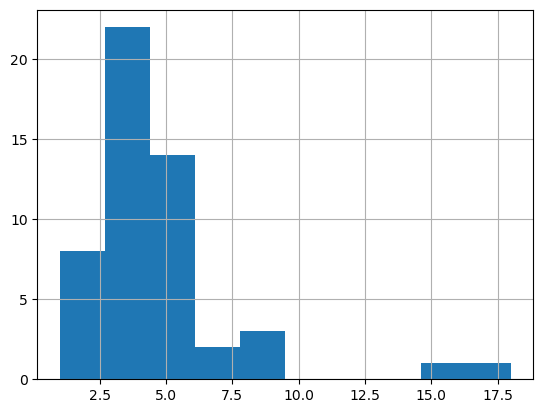

# UEFA_DataAnalysis

数据分析萌新的小课题

---

## 文档结构

- 代码文件夹
  - .ipynb文件
  - 爬虫代码
  - 数据清洗代码
  - 数据分析代码
- 数据文件夹
    - 爬取数据
    - 清洗数据
    - 分析数据
- 文档
    - 笔记文档
    - 项目简介
    - 元数据

## 数据分析发现

### 各裁判每场黄牌总数直方图

存在两场异常值：
- match_id 2036195：小组赛 捷克    vs  土耳其 黄牌数18张
- match_id 2036205：淘汰赛 西班牙 vs  德国    黄牌数15张

该指标后续分析将排除这两场比赛

排除异常值后初步描述黄牌数分布情况

比赛数量 | 平均 | 标准差 | 最小值 | 25% | 中位数 | 75% | 最大值
----|----|----|----|----|----|----|----
49 | 4.22 | 1.96 | 1 | 3 | 4 | 5 | 9
